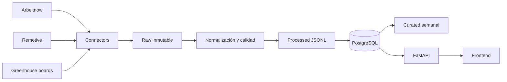

# Arquitectura

FastAPI sigue una hexagonal ligera:

- `domain`: entidades independientes de persistencia.
- `application`: puertos de lectura.
- `infrastructure`: SQLAlchemy, modelos y repositorios.
- `presentation`: esquemas Pydantic y rutas HTTP.

La plataforma de datos comparte contratos explícitos con la API, pero mantiene conectores,
transformaciones, calidad y scripts separados. Es un monolito modular desplegable como una unidad.

## Decisiones

- PostgreSQL es la fuente de lectura de la API; raw JSON nunca entra en `jobs`.
- El upsert usa `(source_id, external_id)`.
- Las fechas entrantes se convierten a UTC y la API las serializa como ISO 8601.
- Salarios se extraen solo del campo salarial explícito de la fuente.
- La clasificación de rol prioriza el título.
- Las ofertas no tecnológicas permanecen en raw y en el índice, pero no llegan a processed ni jobs.
- `duplicate_group_id` solo se conserva cuando el mismo fingerprint aparece en fuentes distintas.
- Cada petición externa tiene timeout y reintentos exponenciales configurables.
- Un conector fallido no bloquea los demás; la ejecución termina como `partial_success`.
